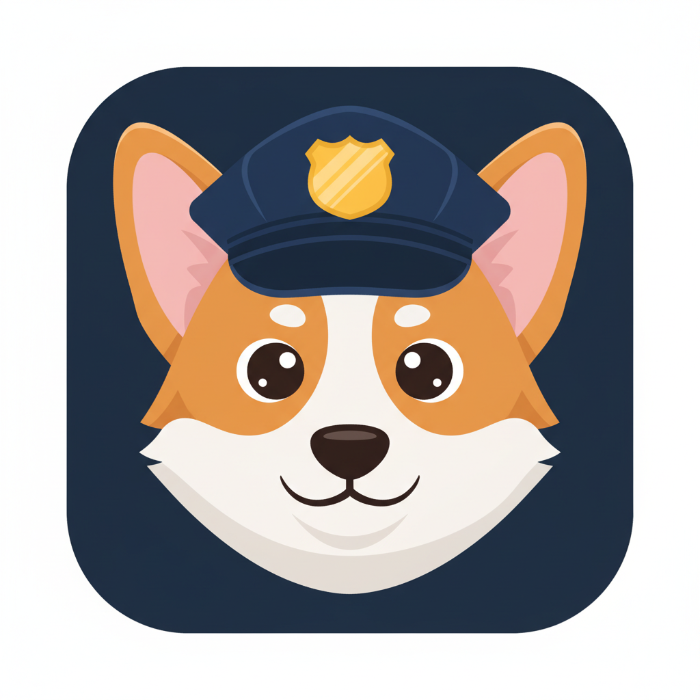

<p align="center">
  
</p>

# Claude Watchdog

A service that monitors Claude Code sessions, maintains persistent memory across sessions, detects stalls, and can autonomously drive Claude toward a goal.

Runs as a local HTTP server (default port 7888) with a web dashboard.

---

## Table of Contents

1. [Quick Start](#1-quick-start)
2. [Session Monitoring](#2-session-monitoring)
3. [Memory System](#3-memory-system)
4. [Drive Mode](#4-drive-mode)
5. [Web Dashboard](#5-web-dashboard)
6. [Terminal Injection](#6-terminal-injection)
7. [Configuration Reference](#7-configuration-reference)
8. [API Reference](#8-api-reference)
9. [Data Storage](#9-data-storage)
10. [Troubleshooting](#10-troubleshooting)

---

## 1. Quick Start

```bash
# Start the dashboard (most common usage)
python -m claude_watchdog --web

# Open in browser
open http://localhost:7888

# Single check (no server)
python -m claude_watchdog --once

# Drive mode from CLI
python -m claude_watchdog --drive --target "implement feature X" --session abc12345
```

### Requirements

- macOS (uses CGEvents/Quartz for TTY injection, osascript, Terminal.app)
- Ollama running locally (`http://localhost:11434`) with `qwen3:14b` model
- Claude Code sessions in `~/.claude/projects/*/session_*.jsonl`
- Optional: tmux (for terminal injection into tmux panes)

---

## 2. Session Monitoring

The watchdog polls Claude Code session files every 30 seconds and classifies each session's state.

### Session States

| State | Meaning |
|-------|---------|
| **working** | Claude is actively processing (recent activity, not idle) |
| **waiting** | Claude finished a turn and is waiting for user input |
| **idle** | No activity for longer than threshold, but no stall detected |
| **stalled** | Inactive beyond threshold with a detected stall pattern |

### Stall Types

| Type | What Happened |
|------|---------------|
| `tool_hung` | A tool was called but never returned a result |
| `no_response_after_tool_result` | Tool result was sent but Claude never replied |
| `stream_interrupted` | Claude's response was cut off (no `end_turn`) |
| `no_response_after_user` | User sent a message but Claude never responded |

### What Happens on Stall

1. Watchdog reads the last 50KB of the session JSONL
2. Classifies the stall type
3. Sends context to Ollama for analysis (progress summary, stall reason, suggested resume prompt)
4. Writes a resume markdown file to `~/.claude/watchdog/resume-{id}-{timestamp}.md`
5. Sends a macOS notification
6. Tracks the alert to avoid duplicate notifications

---

## 3. Memory System

Persistent project memory that survives session restarts and context compaction. Memory is stored per-project as JSON.

### Memory Categories

| Category | Purpose | Item Limit |
|----------|---------|------------|
| `constraints` | Rules, failed approaches (DO NOT retry these) | 20 |
| `results` | Metrics, numeric outcomes, benchmarks | 10 |
| `decisions` | Why approach A was chosen over B | 10 |
| `working_config` | Paths, commands, versions, settings | 10 |

All items are kept under 80 characters.

### Three Memory Flows

#### Flow 1: Memory Injection (SessionStart)

When Claude starts a new session, the watchdog injects existing project memory as context.

```
Claude session starts
  → SessionStart hook fires
  → Watchdog reads project memory JSON
  → Returns formatted context as additionalContext
  → Claude sees: "[Project Memory — from previous sessions]
     Constraints & Failed Approaches (DO NOT retry these):
       - do not use grid Coulomb: wrong 1/r2 exponent
     Known Results (verify — may be outdated):
       - qwen3:14b achieved 6/6 accuracy, 11.4s avg
     ..."
```

#### Flow 2: Self-Summarize (Stop hook — primary)

When Claude stops responding, the watchdog checks if the output was significant, then asks Claude itself to update its memory file.

```
Claude finishes a turn
  → Stop hook fires → watchdog receives last_assistant_message
  → Quick filter: skip short (<200 chars) or routine messages
  → Ollama YES/NO significance check (num_predict: 10, fast)
  → If YES:
      → Wait 3 seconds for Claude to settle into idle
      → Inject self-summarize prompt into Claude's terminal
      → Claude reads memory JSON → merges new findings → writes it back
  → If NO: skip (nothing worth saving)
```

**Why Claude updates its own memory**: Claude is smarter than Ollama. It understands what's important, can properly merge findings, and has full context of the conversation. Ollama just does the trivial YES/NO gate.

**Cooldown**: 5 minutes per project. Prevents re-triggering when Claude's self-summarize response itself fires another Stop hook.

#### Flow 3: Ollama Extraction (PreCompact — fallback)

Before context compaction, Ollama extracts facts directly (since we can't inject into Claude during compaction).

```
Context window filling up
  → PreCompact hook fires
  → Watchdog reads last 200KB / 50 messages from transcript
  → Ollama extracts facts (add + remove) into structured categories
  → Saves to project memory JSON (synchronous — must complete before context is lost)
```

This is the fallback path. Less accurate than self-summarize but works when injection isn't possible.

### Memory File Format

Stored at `~/.claude/watchdog/project_memory/{project-slug}.json`:

```json
{
  "project": "/Users/user/code/myproject",
  "constraints": [
    "do not use grid Coulomb: wrong 1/r2 exponent",
    "do not use /no_think in prompt: fails with Ollama generate API"
  ],
  "results": [
    "qwen3:14b achieved 6/6 accuracy, 11.4s avg"
  ],
  "decisions": [
    "think: false chosen over /no_think for Ollama API compat"
  ],
  "working_config": [
    "num_predict: 2048 for extraction",
    "PreCompact: sync with 60s timeout"
  ],
  "updated_at": "2026-03-05T12:34:56"
}
```

### Manual Memory Management

From the dashboard's Project Memory panel:
- **Add items**: Select category, type text, click Add
- **Remove items**: Click the `x` button next to any item
- **Ask Claude to update memory**: Button that triggers self-summarize on demand (bypasses significance check, still respects cooldown)

API endpoints for memory:
- `POST /api/project_memory` — add/remove items: `{project, category, add: [...], remove: [...]}`
- `POST /api/memory/summarize/{short_id}` — manual self-summarize trigger
- `POST /api/memory/extract` — hook endpoint for Stop/PreCompact memory extraction
- `POST /api/memory/inject` — hook endpoint for SessionStart memory injection

---

## 4. Drive Mode

Autonomous task orchestration. The watchdog drives Claude toward a goal by evaluating progress and injecting instructions, using Ollama as the evaluator.

### How It Works

```
1. You set a target: "implement feature X with tests"
2. Watchdog starts a drive loop (background thread)
3. Every check_interval seconds:
   a. Read Claude's recent output (last 10 messages)
   b. Send to Ollama: "Given this target, what's the status?"
   c. Ollama returns: {status, progress_pct, next_instruction, memory_add/remove}
   d. If not_done: inject next_instruction into Claude's terminal
   e. If done: stop drive, notify
   f. If blocked: log, notify, continue checking
4. Claude processes the instruction, produces output
5. Stop hook fires → drive hook intercepts → re-evaluates immediately
6. Repeat until done or max_iterations reached
```

### Drive Memory

Separate from project memory. Tracks session-specific progress:
- Goal status updates ("auth module: 80% done")
- Blockers ("waiting for API key")
- Approach notes ("using JWT, not sessions")

Drive memory is combined with project memory when building instructions, giving Claude both long-term knowledge and current progress.

### Starting a Drive

**From CLI:**
```bash
python -m claude_watchdog --drive \
  --target "implement user auth with JWT" \
  --session abc12345 \
  --check-interval 30 \
  --max-iterations 50
```

**From dashboard:**
1. Select a session
2. Open the Drive panel
3. Enter target in the textarea
4. Click "Start Drive"

### Drive States

| State | Meaning |
|-------|---------|
| `driving` | Active — evaluating and injecting |
| `done` | Target achieved (Ollama confirmed) |
| `paused` | Manually stopped or max iterations hit |
| `blocked` | Stuck — needs user intervention |

### Drive Hook Integration

When Claude's Stop hook fires during an active drive:
- The drive hook (`/api/drive/hook`) intercepts
- Evaluates progress via Ollama
- If not done: returns `{decision: "block"}` with the next instruction — this prevents Claude from actually stopping and feeds it the next task
- If done: returns empty (lets Claude stop normally)

---

## 5. Web Dashboard

Real-time monitoring UI at `http://localhost:{port}` (default 7888).

### Layout

- **Header**: Session count, status badges (working/waiting/stalled/idle), refresh button
- **Left panel**: Session list with project name, model, age, status badge
- **Right panel**: Detail view for selected session

### Detail Panel Features

- **Session info**: Project path, CWD, model, version
- **Stall banner**: Shows stall type and description (if stalled)
- **Recent messages**: Last 5 user/assistant messages
- **Resume summary**: Collapsible, shows Ollama's analysis (if generated)
- **Actions**:
  - Copy session info to clipboard
  - Send text to Claude's terminal
  - Summarize (on-demand Ollama analysis)
  - Inject prompt (custom textarea)
- **Drive panel**: Target editor, progress bar, memory, action log, start/stop buttons
- **Project Memory panel**: View/add/remove items by category, "Ask Claude to update memory" button

### Real-time Updates (SSE)

The dashboard uses Server-Sent Events (`GET /api/events`) for real-time updates. The server checks for changes every 3 seconds and only pushes data when session state actually changes (hash-based deduplication). Keepalive comments are sent otherwise.

Uses `ThreadingHTTPServer` to handle concurrent SSE connections alongside normal requests.

Detail panel re-rendering is skipped when nothing meaningful changed, preserving scroll position. A manual Refresh button is available for on-demand fetching.

---

## 6. Terminal Injection

The watchdog can send text to Claude's terminal. Two methods:

### Tmux Sessions

- Discovers Claude processes via `pgrep -x claude`
- Maps PIDs to tmux panes via `tmux list-panes`
- Sends text with `tmux send-keys -l` (literal mode) + Enter
- Supports named tmux sockets (e.g., `claude-swarm-*`)

### Terminal.app (TTY) Sessions

- Activates the correct Terminal.app window/tab via osascript
- Types text and presses Enter via CGEvents (Quartz HID-level keyboard injection)
- CGEvents are necessary because System Events keystrokes and direct TTY writes don't reach Claude Code's raw terminal input
- Falls back to clipboard + osascript if CGEvents fail (PermissionError)

### Process Matching

Sessions are matched to running processes by comparing the session's project path (from transcript directory) to the process CWD (from `lsof`). Exact match preferred, falls back to ancestor/descendant directory matching.

---

## 7. Configuration Reference

### CLI Arguments

| Argument | Default | Description |
|----------|---------|-------------|
| `--threshold N` | 5 | Minutes of inactivity before stall detection |
| `--interval N` | 30 | Seconds between poll cycles |
| `--model M` | qwen3:14b | Ollama model for all LLM calls |
| `--once` | — | Single check, then exit |
| `--foreground` | — | Verbose debug logging |
| `--web` | — | Start web dashboard |
| `--port N` | 7888 | Dashboard HTTP port |
| `--drive` | — | Enter drive mode |
| `--target TEXT` | — | Drive target description |
| `--target-file PATH` | — | Read drive target from file |
| `--session ID` | — | Session to drive (short_id, "1" for most recent, or project name) |
| `--check-interval N` | 30 | Drive evaluation frequency (seconds) |
| `--max-iterations N` | 50 | Max drive evaluation cycles |

### Internal Constants

| Constant | Value | Purpose |
|----------|-------|---------|
| `SUMMARIZE_COOLDOWN` | 300s (5 min) | Min time between self-summarize triggers per project |
| `MEMORY_CAT_LIMITS` | constraints:20, others:10 | Max items per category |
| `TAIL_BYTES` | 50KB | How much of session JSONL to read for stall detection |

---

## 8. API Reference

### GET Endpoints

| Endpoint | Description |
|----------|-------------|
| `GET /` | Dashboard HTML |
| `GET /api/sessions` | All session snapshots (JSON array) |
| `GET /api/events` | SSE stream — pushes session data on change |
| `GET /api/drive/{short_id}` | Drive state for a session |
| `GET /static/*` | Static assets (JS, CSS, favicon) |

### POST Endpoints

| Endpoint | Body | Description |
|----------|------|-------------|
| `POST /api/send/{short_id}` | `{text}` | Send text to session's terminal |
| `POST /api/summarize/{short_id}` | — | On-demand Ollama stall analysis |
| `POST /api/inject` | `{text, target}` | Inject prompt (target: short_id, index, or "waiting") |
| `POST /api/inject/waiting` | `{text}` | Inject into most recent waiting session |
| `POST /api/copy` | `{text}` | Copy text to macOS clipboard |
| `POST /api/drive/start/{short_id}` | `{target, check_interval?, max_iterations?}` | Start driving a session |
| `POST /api/drive/stop/{short_id}` | — | Stop driving a session |
| `POST /api/drive/target/{short_id}` | `{target}` | Update drive target text |
| `POST /api/drive/hook` | Hook JSON | Claude Code Stop hook for drive evaluation |
| `POST /api/project_memory` | `{project, category, add, remove}` | Add/remove memory items |
| `POST /api/memory/summarize/{short_id}` | — | Trigger self-summarize |
| `POST /api/memory/extract` | Hook JSON | Stop/PreCompact memory extraction hook |
| `POST /api/memory/inject` | Hook JSON | SessionStart memory injection hook |

---

## 9. Data Storage

All data under `~/.claude/watchdog/`:

```
~/.claude/watchdog/
├── state.json                    # Stall alert tracking (session → last alert UUID)
├── project_memory/
│   └── {project-slug}.json       # Persistent memory per project
├── drives/
│   └── {short-id}.json           # Drive state + log per session
└── resume-{id}-{ts}.md           # Generated stall analysis/resume prompts
```

Claude Code session files are read from `~/.claude/projects/*/session_*.jsonl` (not modified).

---

## 10. Troubleshooting

### Ollama not responding
- Check `curl http://localhost:11434/api/tags` — should list models
- Ensure `qwen3:14b` is pulled: `ollama pull qwen3:14b`
- Significance check fails safe (returns NO, skips trigger)

### Self-summarize not triggering
- Check cooldown: 5-minute minimum between triggers per project
- Check significance: routine/short messages are filtered out
- Check process discovery: `python3 -c "from claude_watchdog import discover_claude_processes; print(discover_claude_processes())"` — should find your Claude process
- Check logs for "Significance=YES/NO" and "Self-summarize" entries

### Terminal injection not working
- **Tmux**: Verify `tmux list-panes -a` shows your Claude session
- **Terminal.app (CGEvents)**: Grant Accessibility permissions to Terminal in System Settings → Privacy & Security
- **TTY not working**: CGEvents require the Terminal window to be frontmost; ensure osascript can activate Terminal
- **No process found**: Session CWD must match the project path

### Drive not progressing
- Check max_iterations hasn't been reached (auto-pauses at limit)
- Check drive log in dashboard for "blocked" or "error" entries
- 5 consecutive inject failures auto-pause the drive
- Verify Ollama can reach the model (drive eval uses 180s timeout)

### Memory not persisting
- Check `~/.claude/watchdog/project_memory/` for JSON files
- Verify SessionStart hook is configured in Claude Code settings
- Check that the transcript path contains a valid project directory name
